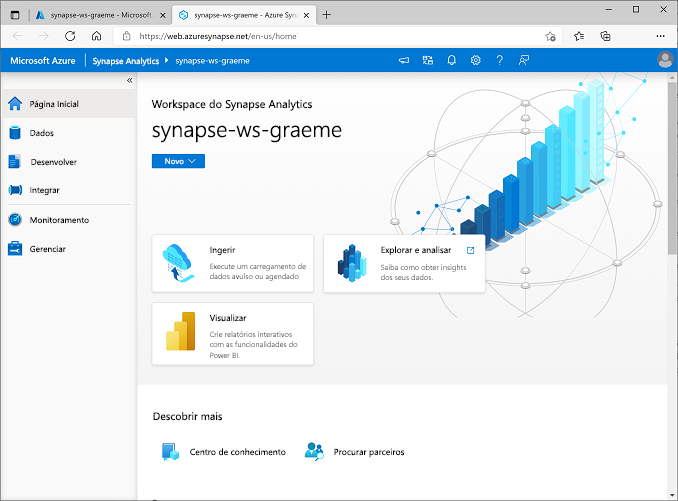

---
lab:
  title: Explorar o Spark Streaming no Azure Synapse Analytics
  module: Explore fundamentals of real-time analytics
---

# Explorar o Spark Streaming no Azure Synapse Analytics

Neste exercício, você usará o *Streaming Estruturado do Spark* e *tabelas delta* no Azure Synapse Analytics para processar dados de streaming.

Este laboratório levará aproximadamente **15** minutos para ser concluído.

## Antes de começar

É necessário ter uma [assinatura do Azure](https://azure.microsoft.com/free) com acesso de nível administrativo.

## Provisionar um workspace do Synapse Analytics

Para usar o Synapse Analytics, você deve provisionar um recurso de workspace do Synapse Analytics em sua assinatura do Azure.

1. Abra o portal do Azure em [Portal do Azure](https://portal.azure.com?azure-portal=true) e entre usando as credenciais associadas a sua assinatura do Azure.

    >                 **Observação**: verifique se você está trabalhando no diretório que contém a sua própria assinatura (indicado no canto superior direito embaixo da sua ID de usuário). Caso contrário, selecione o ícone de usuário e o troque o diretório.

2. Na portal do Azure, na **Página Inicial**, use o ícone **&#65291; Criar um recurso** para criar um recurso.
3. Pesquise por *Azure Synapse Analytics* e crie um recurso do **Azure Synapse Analytics** com as seguintes configurações:
    - **Assinatura**: *sua assinatura do Azure*
        - **Grupo de recursos**: *Criar um grupo de recursos com um nome apropriado, como "synapse-rg"*
        - **Grupo de recursos gerenciado**: *Insira um nome apropriado, por exemplo, "synapse-managed-rg"*.
    - **Nome do workspace**: *Insira um nome exclusivo para o workspace, por exemplo, "synapse-ws-<seu_nome>*.
    - **Região**: *Selecione qualquer região disponível*.
    - **Selecione o Data Lake Storage Gen 2**: Da assinatura
        - **Nome da conta**: *Crie conta com um nome exclusivo, por exemplo, "datalake<seu_nome>"*.
        - **Nome do sistema de arquivos**: *Crie um sistema de arquivos com um nome exclusivo, por exemplo "fs<seu_nome>"*.

    >                 **Observação**: um workspace do Synapse Analytics requer dois grupos de recursos na assinatura do Azure: um para recursos criados explicitamente e outro para recursos gerenciados que são usados ​​pelo serviço. Ele também requer uma conta de armazenamento de Data Lake para armazenar dados, scripts e outros artefatos.

4. Depois de inserir esses detalhes, selecione **Revisar + criar** e selecione **Criar** para criar o workspace.
5. Aguarde a criação do workspace, isso levará cerca de cinco minutos.
6. Quando a implantação for concluída, vá para o grupo de recursos que foi criado e observe que ele contém o workspace do Synapse Analytics e uma conta de armazenamento Data Lake.
7. Selecione o seu workspace do Synapse e a página de **Visão Geral** dele, no cartão do **Open Synapse Studio**, selecione **Abrir** para abrir o Synapse Studio em uma nova guia do navegador. O Synapse Studio é uma interface baseada na Web que pode ser usada para trabalhar com o seu workspace do Synapse Analytics.
8. No lado esquerdo do Synapse Studio, use o ícone **&rsaquo;&rsaquo;** para expandir o menu — isso revela as diferentes páginas do Synapse Studio que você usará para gerenciar recursos e executar tarefas de análise de dados, conforme mostrado aqui:

    

## Criar um pool do Spark

Para usar o Spark para processar dados de streaming, você precisa adicionar um pool do Spark ao seu espaço de trabalho do Azure Synapse.

1. No Synapse Studio, selecione a página **Gerenciar**.
2. Selecione a guia **pools do Apache Spark** e use o ícone **&#65291; Novo** para criar um pool do Spark com as seguintes configurações:
    - **Nome do pool do Apache Spark**: sparkpool
    - **Família do tamanho do nó**: Otimizado para memória
    - **Tamanho do nó**: Pequeno (4 vCores / 32 GB)
    - **Dimensionamento automático**: Habilitado
    - **Número de nós** 3----3
3. Revise e crie o pool do Spark e aguarde até que ele seja implantado (o que pode levar alguns minutos).

## Explorar o processamento de fluxo

Para explorar o processamento de fluxo com o Spark, você usará um notebook que contém código Python e anotações para ajudá-lo a realizar algum processamento de fluxo básico com o Streaming Estruturado do Spark e tabelas delta.

1. Baixe o notebook [Fluxo Estruturado e Tabelas Delta.ipynb](https://github.com/MicrosoftLearning/DP-900T00A-Azure-Data-Fundamentals/raw/master/streaming/Spark%20Structured%20Streaming%20and%20Delta%20Tables.ipynb) para o seu computador local (se o notebook for aberto como um arquivo de texto em seu navegador, salve-o em uma pasta local; tomando cuidado para salvá-lo como **Fluxo Estruturado e Tabelas Delta.ipynb**, não como um arquivo .txt)
2. No Synapse Studio, selecione a página **Desenvolver**.
3. No menu **&#65291;**, selecione **&#8612; Importar** e o arquivo **Fluxo Estruturado e Tabelas Delta.ipynb** no seu computador local.
4. Siga as instruções no notebook para anexá-lo ao seu pool do Spark e execute as células de código que ele contém para explorar várias maneiras de usar o Spark para processamento de fluxo.

## Excluir recursos do Azure

>                 **Observação**: se o seu objetivo for realizar outros exercícios que usam o Azure Synapse Analytics, ignore esta seção. Caso contrário, siga as etapas abaixo para evitar custos desnecessários com o Azure.

1. Feche a guia do navegador do Synapse Studio, sem salvar nenhuma alteração, e retorne ao portal do Azure.
1. No portal do Azure, na **Página Inicial**, selecione **Grupos de recursos**.
1. Selecione o grupo de recursos para o workspace do Synapse Analytics (não o grupo de recursos gerenciado) e verifique se ele contém o workspace do Synapse, a conta de armazenamento e o pool do Data Explorer para seu workspace (se você concluiu o exercício anterior, ele também conterá um pool do Spark).
1. Na parte superior da página de **Visão Geral** do grupo de recursos, selecione **Excluir o grupo de recursos**.
1. Digite o nome do grupo de recursos para confirmar que deseja excluí-lo e selecione **Excluir**.

    Após alguns minutos, seu workspace do Azure Synapse e o workspace gerenciado associado a ele serão excluídos.
